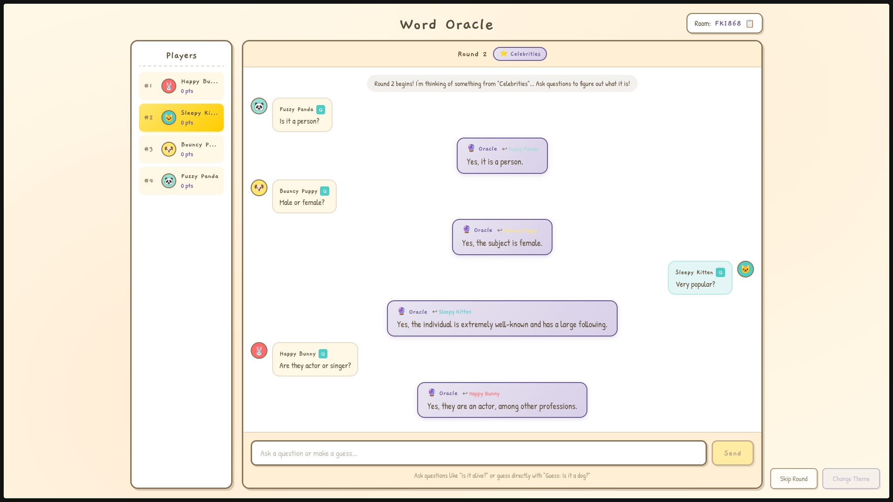

# Word Oracle (Host it locally with <a href="https://ngrok.com">ngrok</a> and <a href="https://ollama.com">Ollama</a> / <a href="https://github.com/ggml-org/llama.cpp">llama.cpp</a> and have fun with your friends!!)

</img>

A multiplayer word guessing game powered by AI. Players join a game room, choose a theme, and take turns asking questions to an AI Oracle who knows a secret word. The Oracle answers truthfully without revealing the word directly.

## Features

- **AI Oracle** - An LLM-powered oracle answers questions about the secret word using web search for accurate responses
- **Theme Categories** - 12 themes including Sports, Celebrities, Food, Animals, Movies, Music, History, Science, Geography, Gaming, and Literature
- **Real-Time Multiplayer** - WebSocket-based synchronization for up to 8 players
- **Scoring System** - First to guess the word wins the round and earns a point
- **Host Controls** - Only the room creator can select themes and manage game flow
- **Modern Pop Culture** - Word generation prioritizes post-2015 content for relevant themes
- **Jailbreak Protection** - The Oracle rejects imperative commands to stay in character

## Tech Stack

- **Bun** - Runtime, package manager, and server
- **SQLite** - Persistent word storage (via `bun:sqlite`)
- **React 19** - Frontend UI
- **Tailwind CSS** - Styling
- **AI Models** - Multiple provider support: Groq, OpenAI, Anthropic, Gemini, Grok (xAI), and Local LLM
- **DuckDuckGo API** - Web search for context-aware answers
- **WebSocket** - Real-time communication (Bun built-in)

## Getting Started

### Prerequisites

- [Bun](https://bun.sh/) installed
- API Keys for your preferred AI providers (Groq, OpenAI, Anthropic, Gemini, or Grok)

### Installation

```bash
bun install
```

### Configuration

Create a `.env` file:

```bash
# General AI Provider Selection (openai, anthropic, gemini, grok, groq)
AI_PROVIDER=groq

# Provider API Keys
GROQ_API_KEY=your_groq_api_key
OPENAI_API_KEY=your_openai_api_key
ANTHROPIC_API_KEY=your_anthropic_api_key
GEMINI_API_KEY=your_gemini_api_key
GROK_API_KEY=your_grok_api_key

# Local Model Configuration (Optional)
USE_LOCAL_MODEL_FOR_QUERY=false
LOCAL_MODEL_URL=http://localhost:8080/v1/chat/completions

# Model Selection (Optional defaults are used if not provided)
# GROQ_MODEL, OPENAI_MODEL, ANTHROPIC_MODEL, GEMINI_MODEL, GROK_MODEL
```

### Development

```bash
bun dev
```

### Production

```bash
bun start
```

## Game Mechanics

- **Word Generation**: Words are generated in batches of 50 using a cloud-only waterfall strategy (Groq → OpenAI → Anthropic → Gemini → Grok) for maximum reliability.
- **Persistence**: Generated words are stored in a local SQLite database (`words.sqlite`).
- **Replenishment**: The system automatically generates 50 more words for a theme if the remaining count drops below 15.
- **Consumption**: Words are deleted from the database immediately after being guessed or skipped.

## How to Play

1. Players connect to the game at `http://localhost:3000`
2. Each player gets a unique name, color, and avatar
3. The host selects a theme category to start the game
4. Ask the Oracle questions about the secret word
5. To make a guess, prefix your message with `Guess:` (e.g., "Guess: pizza")
6. First player to guess correctly wins the round and scores a point
7. A new word is chosen and the next round begins

## Project Structure

```
├── index.ts          # Backend server with WebSocket, SQLite, and LLM integration
├── frontend.tsx      # React frontend component
├── index.html        # HTML entry point
├── styles.css        # Styling
├── words.sqlite      # SQLite database for persistent word storage
└── package.json      # Dependencies
```

## License

MIT
